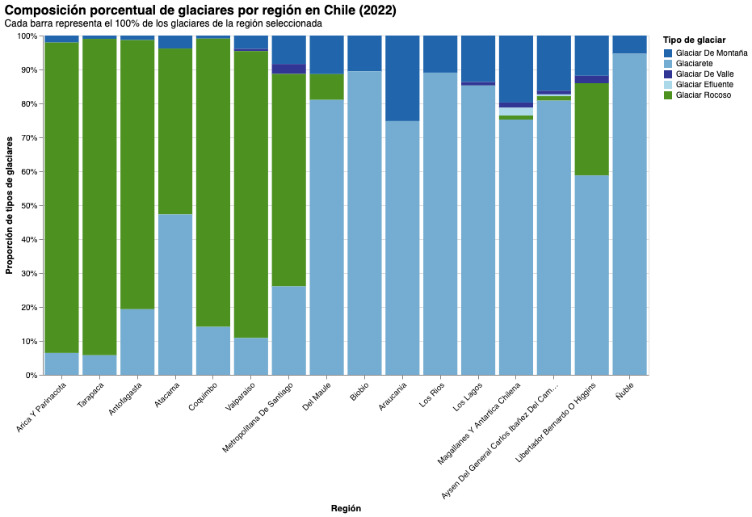

# El hielo que no parece glaciar: las muchas formas en que Chile resguarda su agua
 

 
Chile posee una de las reservas de agua dulce más importantes del mundo, resguardada en diversas formas de hielo que coronan la Cordillera de los Andes. Sin embargo, no todos los glaciares son iguales. El Inventario Público de Glaciares 2022 (IPG 2022), elaborado por la Dirección General de Aguas del Ministerio de Obras Públicas, revela una diversidad morfológica que es clave para entender cómo nuestra geografía resistirá, o no la crisis hídrica que ya golpea al país.
 
## La diversidad del hielo
 
En el norte, donde el sol es implacable y las lluvias escasean, predominan los glaciares rocosos. A diferencia de las masas blancas de postal, estos están cubiertos por detritos o mezclados con roca. Su importancia es vital: actúan como "termos" naturales, protegidos del derretimiento directo por su capa de piedra, siendo la fuente de agua crítica para los valles de Atacama y Coquimbo. En regiones como Arica y Parinacota, Tarapacá y Antofagasta, la composición de la barra del gráfico está dominada por este tipo de hielo. Son invisibles para el turista, pero imprescindibles para la vida.
 
Hacia el centro y sur, aparecen los glaciares de montaña y los glaciares de valle. Estos son los reguladores del caudal de los ríos. En años de sequía extrema, cuando la nieve desaparece temprano en la temporada, es el hielo milenario el que mantiene el flujo de agua para el consumo humano y la agricultura. La Región Metropolitana, con su enorme demanda hídrica y sus glaciaretes menguantes, representa uno de los escenarios más críticos del país.
 
Finalmente, en la zona austral, encontramos los glaciares efluentes: lenguas masivas que se desprenden de los Campos de Hielo Patagónico Norte y Sur. Son los centinelas más visibles del cambio climático global y explican por qué Aysén y Magallanes concentran más del 90% de la masa glaciar nacional.
 
## El caso de Ñuble: cuando la geografía no favorece al hielo
 
Una de las lecturas más reveladoras del gráfico es la barra correspondiente a la Región de Ñuble. A pesar de ser una región cordillerana del centro-sur, su presencia glaciar es notoriamente escasa en comparación con regiones vecinas e incluso con zonas del norte.
 
La explicación no es sencilla, pero la geografía lo dice todo. A diferencia de la zona central donde los Andes superan fácilmente los 4.000 o 5.000 metros, en Ñuble la cordillera promedia cerca de los 2.000 metros de altitud. Sin esa altura, la temperatura no permite la acumulación de hielo permanente extenso. Los pocos glaciares que existen unos 55, concentrados en el complejo Nevados de Chillán están bajo los 3.500 metros sobre el nivel del mar, haciéndolos especialmente vulnerables al calentamiento.
 
A esto se suma el volcanismo activo: el calor geotérmico y las erupciones del complejo volcánico derriten la nieve desde abajo, impidiendo la formación de grandes masas de hielo continuo. Y el clima de transición de la zona genera temperaturas más altas que elevan la línea de nieve, reduciendo el área donde la precipitación cae como nieve en lugar de lluvia.
 
Los glaciares del Nevados de Chillán han experimentado una reducción superior al 90% de su área desde las mediciones históricas de fines del siglo XIX hasta 2019, una de las tasas de pérdida más aceleradas del país.

 
## Un mapa de vulnerabilidad
 
La visualización adjunta no solo muestra números; muestra una estructura de supervivencia. Al normalizar las barras al 100%, el gráfico permite comparar la composición de tipos de glaciares entre regiones muy distintas en tamaño, revelando patrones que una visualización con valores absolutos ocultaría.
 
Mientras que en la Región Metropolitana los glaciaretes luchan por no desaparecer, en Magallanes la escala es monumental pero igualmente amenazada. Entender esta distribución es el primer paso para una política pública que no trate al glaciar solo como una postal turística, sino como la infraestructura hídrica más importante de la nación: una que tardó milenios en construirse y que podría desaparecer en décadas.
 
---
 
*Fuente: Inventario Público de Glaciares 2022 (IPG 2022), Dirección General de Aguas (DGA), Ministerio de Obras Públicas de Chile. Disponible en [dga.mop.gob.cl](https://dga.mop.gob.cl/inventario-publico-de-glaciares-actualizacion-2022/)*